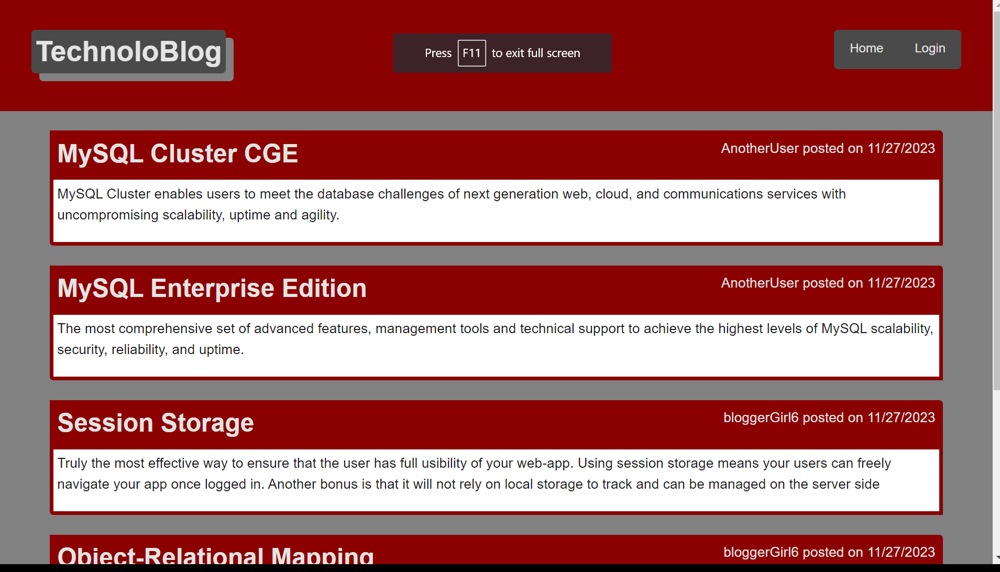
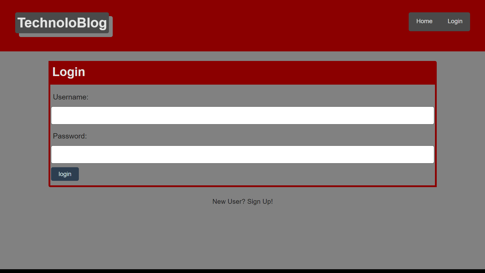
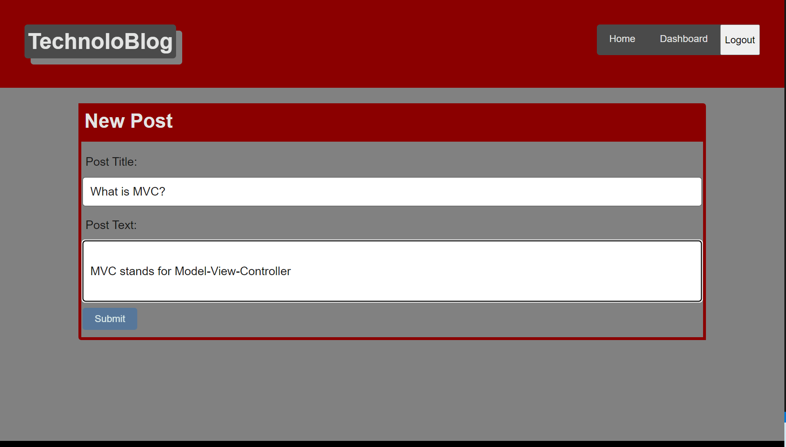
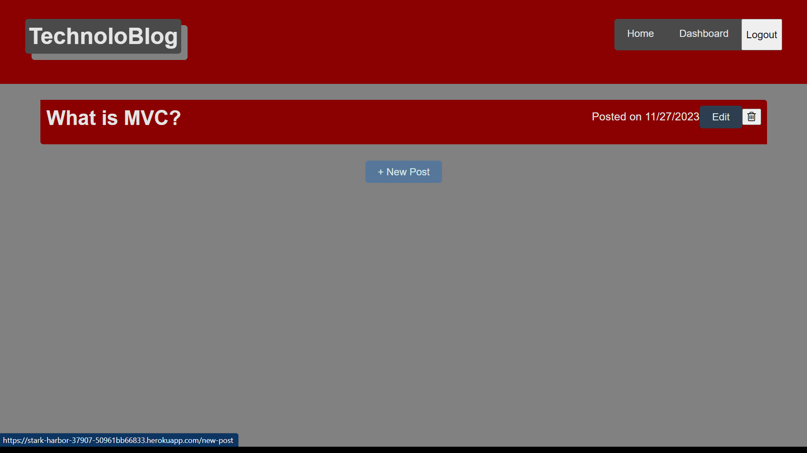

# TechnoloBlog

## Description

TechnoloBlog is a CMS style blog site where you can read up on and contribute to the latest in tech news!  Make an account to interact with the community by creating new posts or commenting on the posts of others!

TechnoloBlog is a MVC application built with a combination of Node.js, Express.js, Sequelize, Bcrypt, and Handlebars

## Table of Contents
* [Installation](#Installation)
* [Screenshots](#Demo)
* [Questions](#Questions)

## Installation 

No installation required!  Simply visit [this link](https://stark-harbor-37907-50961bb66833.herokuapp.com/) and get posting!

## Screenshots 

### Homepage

### Login Page

### New Post Form

### Dashboard

## Questions 

Reach out at my [GitHub!](https://github.com/JustDesmarais)
